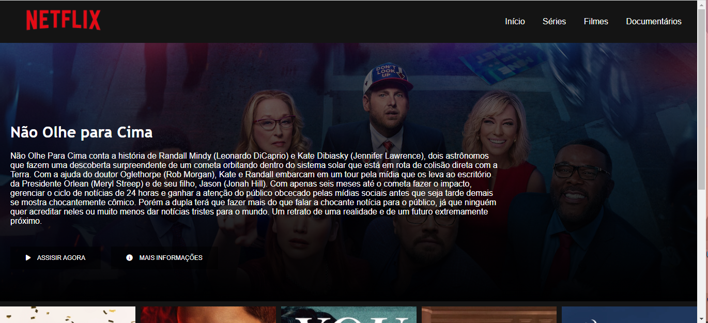
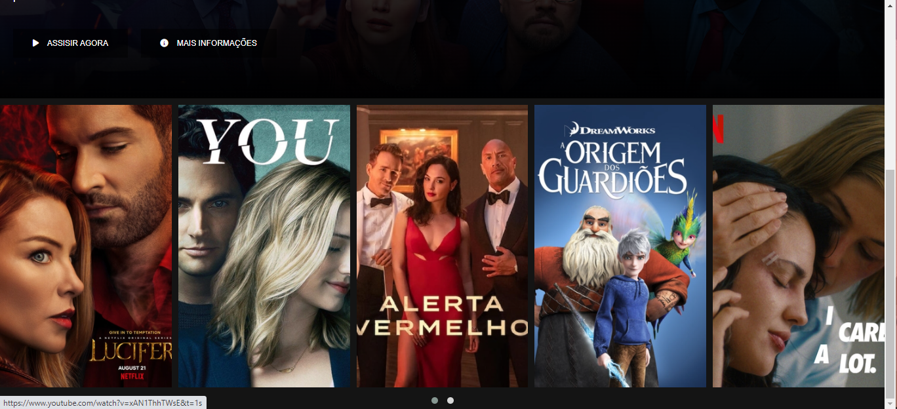

# Clone da Interface da Netflix
Projeto desenvolvido na plataforma DIO, com o objetivo de recriar a interface principal do site de streaming Netflix.

Clique <a href="https://isabellacpmelo.github.io/netflix-clone/">aqui</a> para acessar o projeto.

<a href="https://isabellacpmelo.github.io/netflix-clone/"> 

## Ferramentas utilizadas:
* HTML5
* CSS3
* JavaScript
* JQuery
* [Font Awesomene](https://fontawesome.com/)

## Print do Projeto

### Filme Principal

  
### Carrosel de Filmes

